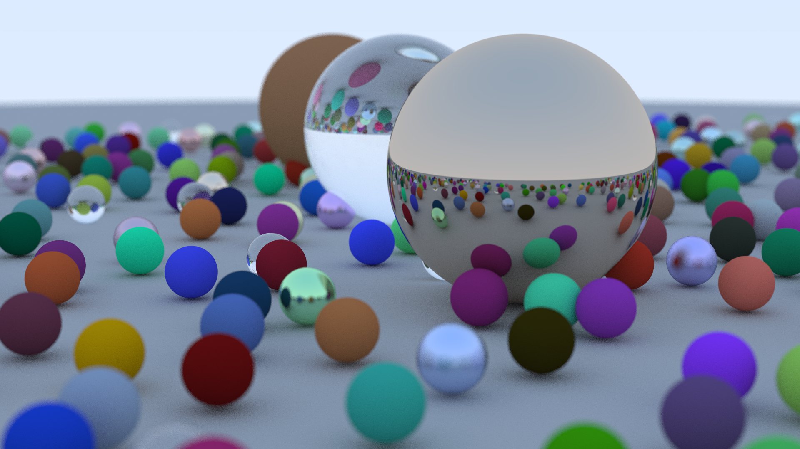

# RayTracer

A simple raytracer written in C++

This project closely follows [_Ray Tracing in One Weekend_](https://raytracing.github.io/books/RayTracingInOneWeekend.html)

## Why

Wanted to get a low level feel of raytracing and computer graphics in general.

## Run

Add your desired config in the main file and render the ppm image:

```bash
make run
```

Convert your render to png version using ImageMagick

```bash
./save-img.sh
```

<p align="center">
    
</p>
